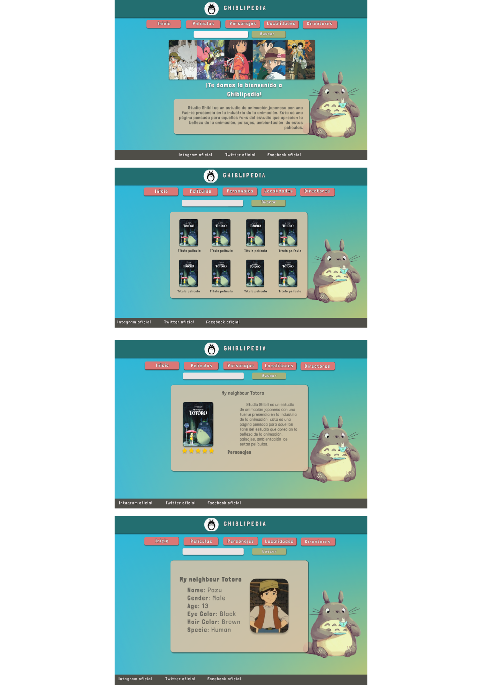

# Data Lovers

## Índice

* [1. Preámbulo](#1-preámbulo)
* [2. Historias de Usuario](#2-Historias-de-Usuario)
* [3. Diseños de prototipos de baja y alta fidelidad](#3-diseños-de-protoptipos-de-alta-fidelidad)
  * [a. Diseño de baja fidelidad](#4-diseño-debaja-fidelidad)
  * [b. Diseño de alta fidelidad](#5-diseño-de-alta-fidelidad)
* [4. Presentación del proyecto](#6-presentación-del-proyecto)
* [7. Tecnologías utilizadas](#7-tecnologías-utilizadas)
* [8. Colaboraciones](#8-colaboraciones)

***

## 1. Preámbulo

El proyecto Ghiblipedia es un página web desarrollada para usuarios de occidente que aman? disfrutan? las producciones de Studio Ghibli, ya sea por sus historias, animaciones, lecciones de vida, música entre otros ámbitos. En esta página el usuario podrá vivir la experiencia Ghiblipedia al encontrar información más detallada sobre sus películas favoritas, incluyendo sus personajes y localidades, acompañado de una de las composiciones musicales más icónicas del estudio .

## 2. Historias de Usuario

Para satisfacer las necesidades del usuario se han planteado sus historias de la siguiente manera:

# Historia de usuario 1
Título:
Ver la lista de películas del Estudio
Descripción:
Como usuario que le gustan las películas de Ghibli quiero visualizar todas las películas que este estudio ha producido para poder conocer cuáles son.

# Historia de usuario 2
Título:
Información sobre un personaje favorito
Descripción:
Como usuario latinoamericano fan de animación japonesa, quiero visualizar información característica de mi personaje favorito para obtener más información sobre él.

# Historia de usuario 3
Título:
Información sobre las localidades de las películas
Descripción:
Como usuario interesado en la cultura japonesa, quiero ver las localidades de las películas para disfrutar con sus bellos paisajes.

# Historia de usuario 4
Título:
Ordenar data alfabéticamente
Descripción:
Como usuario que busca películas de Ghibli quiero ordenar la data alfabéticamente para facilitar la búsqueda de lo que estoy buscando en la lista

# Historia de usuario 5
Título:
Ordenar películas por orden alfabético
Descripción:
Como usuario que busca información sobre películas de Ghibli, quiero ordenar por release date las películas para ver encontrarlas con más facilidad

[Aquí]: http://www.figma.com/file/WwbYjvjnmNZ5orvwl2ey4U/Untitled?type=design&node-id=0%3A1&t=DKRrDAELSdlNlDi1-1/ presentamos el trabajo realizado en figma
 
## 3. Diseños de prototipos de baja y alta fidelidad

  ## a. Diseños de baja fidelidad
Prototipo welcome page de baja fidelidad

Prototipo movies page de baja fidelidad

Paleta de colores elegida:

Se escogió esta paleta de colores de la película Spirited Away por ser una de las más conocidas y aclamadas por la audiencia, por sus tonos cálidos y amigabilidad y por ser de las más representativas del estudio, ya que estos colores principales que se repiten a lo largo de sus producciones.

  # b. TESTEO DE USABILIDAD

EL USUARIO APRUEBA
Respecto a la página de entrada, quizá yo pondría ese mismo mensaje pero dando acceso desde ya al buscador y a la barra lateral y todo eso... Para que esté todo ahí mismo y no sea hacer un clic extra para acceder al contenido. Mensaje de bienvenida correcto. Buen tamaño. Paleta correlacionada con las películas. Se ve intuitivo y lindos colores

EL USUARIO SOLICITA MODIFICACIÓN
Ese diseño está genial, solo que las miniaturas se ven muy miniaturas.
La página me molesta a la vista porque tiene mucha información (imágen de fondo). Quizás el color café con letras blancas no porque hay gente con visión más limitada, entonces  se pierde un poco su contenido.
Sí,  yo quiero ver todos los paisajes de las películas ghibli.

SOLUCIÓN DE DISEÑO
En base a los anteriores testimonios de los usuarios se decide aumentar el tamaño de los contenedores, imágenes y títulos, reemplazar el color de la tipografía del mensaje de inicio reemplazando blanco por café oscuro con un poco de opacidades. 

  ## c. Diseños de alta fidelidad
 Prototipo welcome page de media fidelidad

## 4. Presentación del proyecto

## 5. Tecnologías utilizadas

## 7. Colaboraciones

## 8. Colaboraciones

## 9. Checklist

* [ ] Usa VanillaJS.
* [sí] Pasa linter (`npm run pretest`)
* [sí] Pasa tests (`npm test`)
* [sí] Pruebas unitarias cubren un mínimo del 70% de statements, functions y
  lines y branches.
* [sí] Incluye _Definición del producto_ clara e informativa en `README.md`.
* [sí] Incluye historias de usuario en `README.md`.
* [ ] Incluye _sketch_ de la solución (prototipo de baja fidelidad) en
  `README.md`.
* [ ] Incluye _Diseño de la Interfaz de Usuario_ (prototipo de alta fidelidad)
  en `README.md`.
* [ ] Incluye link a figma en `README.md`.
* [ ] Incluye el listado de problemas que detectaste a través de tests de
  usabilidad en el `README.md`.
* [ ] UI: Muestra lista y/o tabla con datos y/o indicadores.
* [ ] UI: Permite ordenar data por uno o más campos (asc y desc).
* [ ] UI: Permite filtrar data en base a una condición.
* [ ] UI: Es _responsive_.
